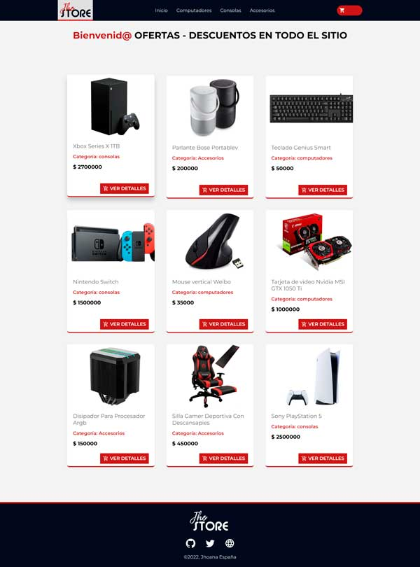

# Proyecto React Store 

_Proyecto final desarrollado en el curso de React de CODERHOUSE 2022.
Página web donde el usuario puede simular la compra de un producto.
Creada con ReactJS, se conecta a un backend realizado en Firebase_

### Project by: Jhoana España
---

---
#### Tecnologías utilizadas
- ReactJS
- JS
- CSS
- HTML
- Firebase

#### librerías

[mui.com](https://mui.com/)
Biblioteca de componentes de React de código abierto que implementa el Material Design de Google.

    npm install @mui/material @emotion/react @emotion/styled

[reactrouter.com](https://reactrouter.com/en/main)
Facilita el proceso de definir las rutas de navegación dentro de nuestra aplicación.

    npm install react-router-dom

